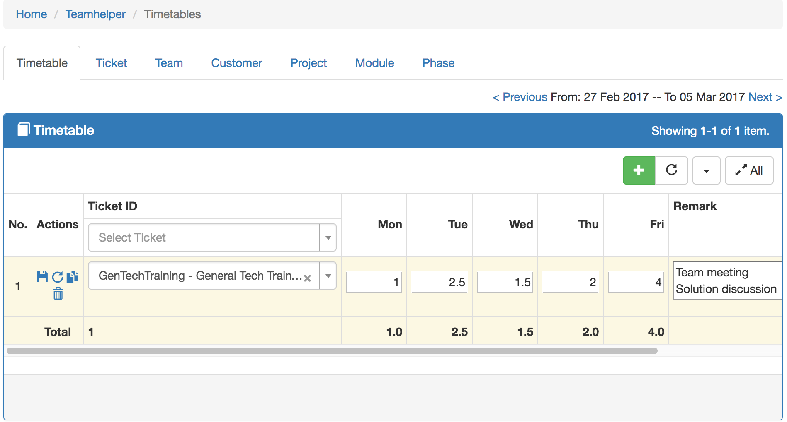
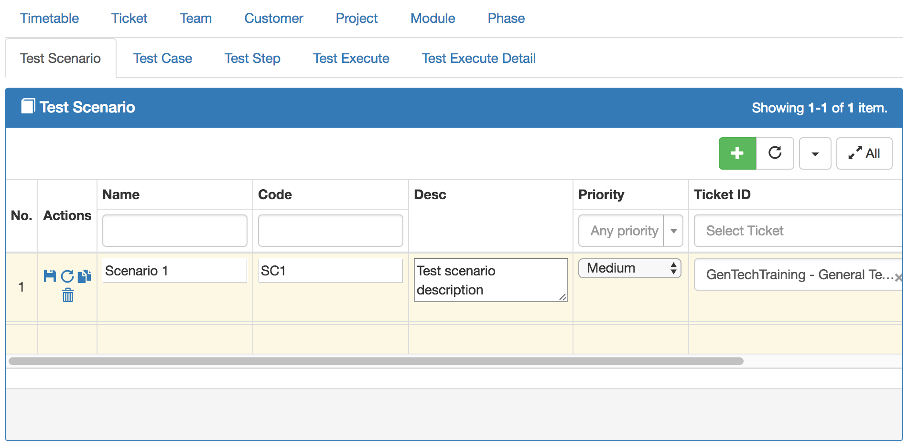

TeamHelper Yii2 Module
===============
Simple Timesheet & Test case management for team collaboration

  

  

Installation
------------

Download / clone to yii2 modules/teamhelper folder  

Require yii2-inlinegrid extension

Either run

```
php composer.phar require --prefer-dist dacduong/yii2-inlinegrid "*"
```

or add

```
"dacduong/yii2-inlinegrid": "*"
```

to the require section of your `composer.json` file.  

Extra helper class help to Import Jira ticket from Jira REST API and Jira webhook: [helpers\JiraHelper.php](./helpers/JiraHelper.php)